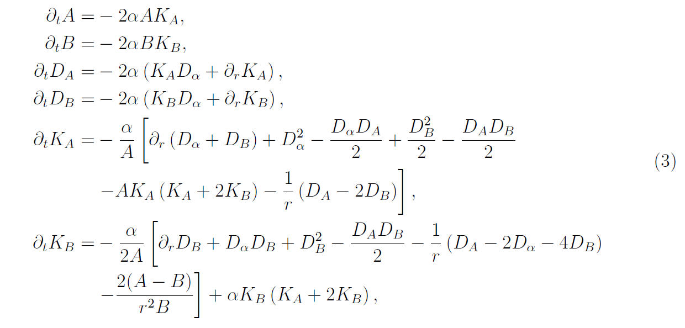

# NR_ADM

The aim of this exercise is to simulate the time evolution of the Schwarzschild metric solving the field equations of General Relativity in ADM formalism. The  equations are: 

where $A(r,t)$ and $B(r,t)$ are defined such that for a spherically-symmetric system (such as the Schwarzschild spacetime), the spatial part of the metric can be written as
$$ d\elle^2 = A(r,t) dr^2 + r^2 B(r,t) d\Omega^2$$

The fields $D_A$ and $D_B$ are auxiliary variables such that $D_i = \partial_r i$ for $i = A, B$. Lastly $K_i$ are the extrinsic curvature non vanishing components, in particular $K_A = K^r_r$ and $K_B = K^\theta_\theta = K^\phi_\phi$.

To avoid eccessive gradients at the origin the following transformation has been applied to those variables:
$$\begin{itemize}
\item A \rightarrow \tilde{A} = A/\psi^4, B \rightarrow \tilde{B} = B/\psi^4 \textt{ for } \psi = 1 + \frac{M}{2r}
\item D_A \rightarrow \tilde{D}_A = D_A - 4\partial_r \log \psi, D_B \rightarrow \tilde{D}_B = D_B - 4\partial_r \log \psi,
\end{itemize}$$

The chosen intial conditions are:
$$\begin{cases}
&\tilde{A} = \tilde{B} = 1\\
&\tilde{D}_A = \tilde{D}_B = 0\\
&K_A = K_B = 0\\
&\alpha = 1
\end{cases}$$

The field $\alpha$ is the lapse function. It follows one of the following evoultion equations:
$$\partial_t \alpha = \begin{cases}&0\\
&-2\alpha K\end{cases}$$
The first case correspond to the gauge choice called "Geodesic Slicing", the second to the "1+Log" choice.

Lastly the apparent horizon has been estimated solving the following equation for $r = r_h$:
$$\frac{1}{\sqrt{A}} \left(\frac{2}{r} + \frac{\partial_r B}{B}\right) - 2K_B = 0$$